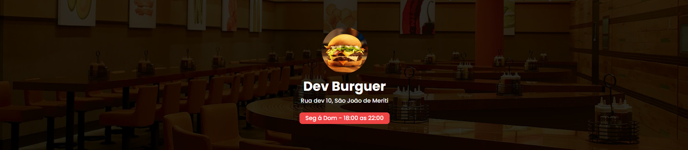
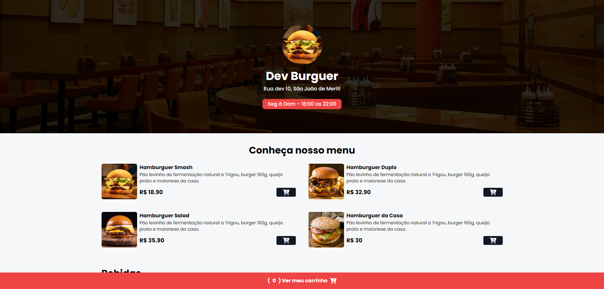
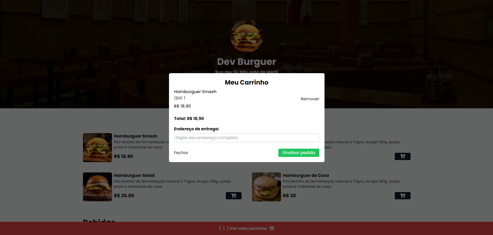
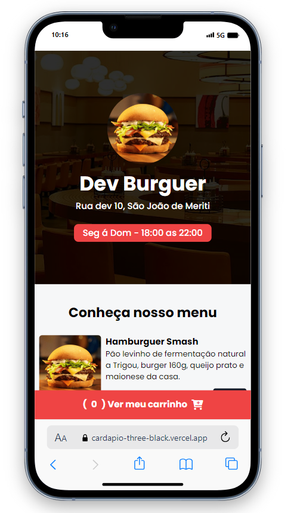

<h1 align="center">
    
    
Cardápio Online

</h1>

## 📕Sobre
**Cardápio Online** é um projeto para quem o restaurante delivery que está começando e precisa melhorar e agilizar o atendimento ao cliente, onde o pedido será enviado via Whatsapp para o restaurante, o Cardápio Online abrange todos os tipos de deliverys.

### 🔗Link do Projeto
- [Clique aqui e veja o projeto](https://cardapio-three-black.vercel.app/)

### 🔎Prévia do projeto
##### 🏡 Página principal

##### 🛒 Carrinho de produtos

##### 📱 Dispositivo Móvel

#### 🔨 Ferramentas Utilizadas
- [HTML5](https://www.w3schools.com/)
- [CSS3](https://www.w3schools.com/)
- [Node](https://nodejs.org/en)
- [TailwindCss](https://tailwindcss.com/)
